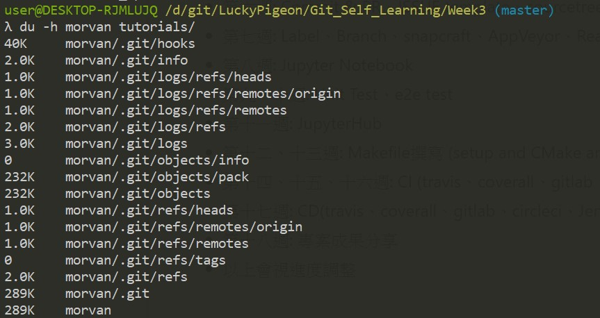
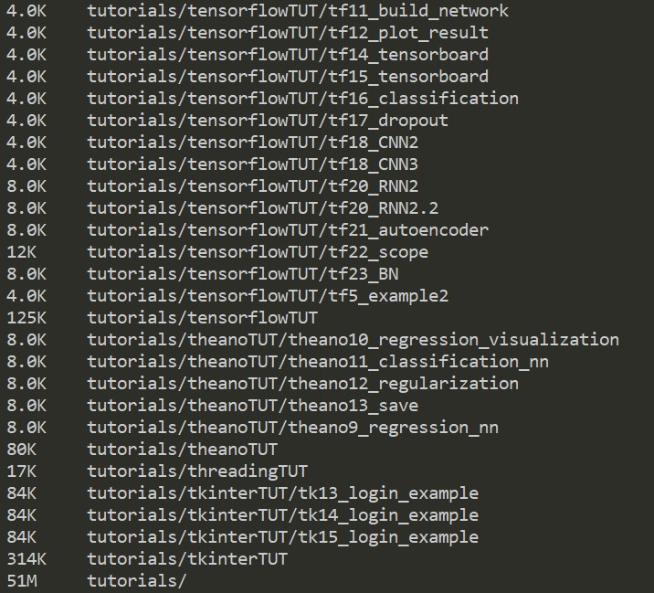

# Week 3
## 當開發大型專案時，我們會遇到
1) 衝突(conflict)
  * branch 互相衝突
  * branch 過期了
  * Old file 與 New file互相衝突
2) 合併(merge)
3) 太多沒用的commit(redundant commit)
4) 送錯commit或者修改commit message
5) 有臨時狀況發生但自己的更改還沒完成
6) 專案太大，整個複製下來太佔空間

## 因應這些問題，我們需要
1) 解決衝突(conflict solving)
  * branch 互相衝突 -> 換到自己的branch，使用`$ git rebase master`把自己的branch移花接木到master上，
  別人再依序效法，branch的label就一個一個接上去了，然後就正常了
  * branch 過期了 -> 代表每次變更前的`$ git pull`沒做好，所以就關掉PR重做，要不然就Discard changes with
  `$ git checkout -- <filename>`，然後確實`$ git pull <remote> <a-branch:b-branch>，再確實把變更做好
  * Old file 與 New file互相衝突 -> 這個最好解，開啟衝突的檔案然後照著指示解開就好了
2) 合併(merge)
  * 看到這個你該開心了，代表你做得太好了，所以讓mantainer用一招`$ git merge <branch>`來減輕你的重擔，讓你
  的PR被標示complete的標籤
3) 太多沒用的commit(redundant commit)
  * 常常會看到有些人改一個空格也要發PR，這些PR發多了會很亂，這時候就需要整理一下
  * 首先，你會需要選擇要更改的範圍，然後選擇最後一個commit，這邊請使用`$ git log --oneline`來選擇你的commit id
  * 然後，使用`$ git rebase i <commit id>`來啟動interactive mode並開啟vim or nano編輯器來做更改
  * 接著，將編輯器裡面你想要合併的commit前面的`pick`改成`squash`，更改完儲存即可
4) 送錯commit或者修改commit message
  * 送錯commit -> 這時候就需要取回commit了，一樣先用`$ git log --oneline`來確認好要取回哪一個commit，這次用倒數的，
  倒數第一個就寫1，用`^`這個表達的話，一個`^`就是往前推一個commit，最後`HEAD`可以跳到最新的commit。然後這次的指令有三
  個模式
    1) mixed模式，指令是`$ git reset <number>`，將commit拉回你的工作區域
    2) soft模式，指令是`$ git reset <number> --soft`，將commit丟回暫存區
    3) hard模式，指令是`$ git reset <number> --hard`，將commit直接丟掉
  * 修改commit -> 使用`$ git commit --amend -m <message>`來更改最後一次的commit message
5) 有臨時狀況發生但自己的更改還沒完成
  * 這時候有兩種處理方式
    1) 先用push commit出去，等臨時狀況處理好了再用`$ git reset HEAD^`來處理還沒處理完的東西
    2) `$ git stash`這個指令會先把正在做的工作打包好並暫存起來，等到臨時狀況處理完了再使用`$ git stash list`查看剛剛
    暫存起來的檔案在哪裡(序數)，然後`$ git stash pop stash@{<number>}`把檔案取出來，繼續處理還沒處理完的東西
6) 專案太大，整個複製下來太佔空間
  * 請看[cdnjs sparse](https://github.com/cdnjs/cdnjs/blob/master/documents/sparseCheckout.md)
  * 目前只有碰過cdnjs有這種需求，不過對於其他架構很複雜的專案也很好用就是了
  * 用莫凡的tutorial來做為示範，我只抓取sklearn這個directory
  * 289K v.s. 51M，差很多吧~
  * 如果修改專案時只會用到特定的資料夾，這麼做還可以確保不會因為什麼相依性的問題，使得其他資料夾的資料無意間被更動了呢!
  * 289K的sklearn directory
  
  * 51M的專案
  
