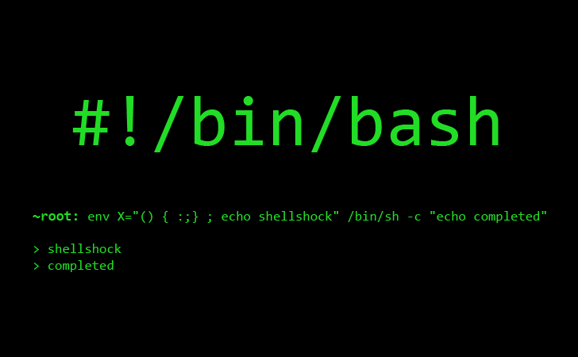

# Week 4
## Git Bash
* LINUX環境上的執行指令環境叫做terminal，也有人稱Bash
* Bash介面

* 而專門執行Git指令並且局LINUX環境上的Bash就叫做GitBash

* Git Bash介面
* 
## Github & Gitlab
* 環境
* PR: 當在開源專案或是與認識的人一起開發時，解決一個問題的過程，可能會需要討論，或者在解決完時，還可能需要做其他更改，最重要的是，可以確認每個人做了多少事情。因為每個PR都需要開新的分支，因此能讓整個專案變得更穩定，也能讓人更去熟悉從開發到被merge的整個過程。
* ISSUE: 當在開源專案或是與認識的人一起開發時，有時會發現bug或是有時靈光乍現，要提出來討論，因為還沒在程式上做更動，因此需要提出ISSUE讓大家一起參與討論。
* 部署網站平台:
  * Github.io 與 Gitlab.io皆是部屬網站的平台，有免費方案可以用
  * 皆有package可以在各種程式語言中直接部署上平台 -> [gh-page](https://www.npmjs.com/package/gh-pages) & [gitlab-pages-webhook](https://www.npmjs.com/package/gitlab-pages-webhook)
  * Documentation -> [Website for Github](https://help.github.com/articles/configuring-a-publishing-source-for-github-pages/) & [Website for Gitlab](https://about.gitlab.com/product/pages/)
* 分享程式碼平台
  * [Github gist](https://gist.github.com/) 與 [Gitlab snippets](https://docs.gitlab.com/ee/user/snippets.html)可以分享常用程式碼片段給所有人，讓自己或有需要的人能夠更輕易地取得程式碼並解決困難。另外，Gitlab的文件說明有獨立出一個[Gitlab Wiki](https://docs.gitlab.com/ee/user/project/wiki/)的環境，跟Github gist也有異曲同工之妙，也可以說是Github gist = Gitlab snippets + Gitlab Wiki
* CI/CD: Github與Gitlab都有自己的自動測試(Continuous Integration)與自動部屬(Continuous Deployment)，分別簡稱CI與CD，Github使用的是[travis CI](https://docs.travis-ci.com/)，而Gitlab使用的是[Gitlab CI/CD](https://docs.gitlab.com/ee/ci/)，只須分別在專案的跟目錄加上.travis.yml與.gitlab-ci.yml檔案即可開啟CI/CD服務
* CI/CD環境: Gitlab使用[Operation](https://docs.gitlab.com/ee/ci/environments.html)來檢視與管理部屬上server的程式，而Github在WebGUI介面檢視與臉部屬的程式碼，並且在travis上檢視部屬後的結果。
## Gitlab獨到之處
### 在Gitlab裡面，你可以用[package](https://packagecloud.io/docs)介面的方式管理在Gitlab中使用到的package，還可以使用[Registry](https://gitlab.com/help/user/project/container_registry)管理docker image，視不同情況將對自己專案開發有幫助的package or docker image下載下來使用吧!
