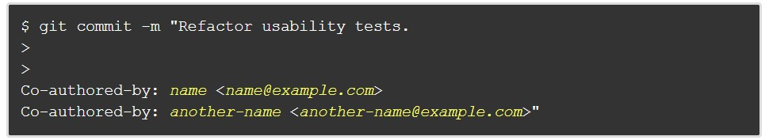
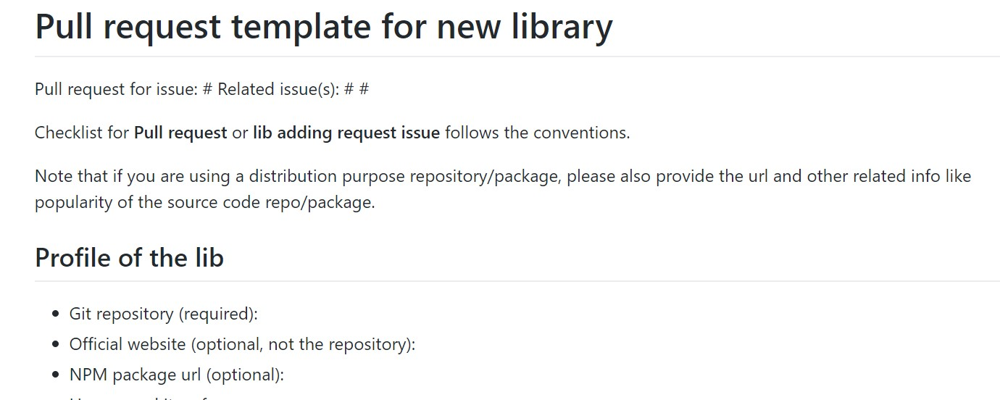
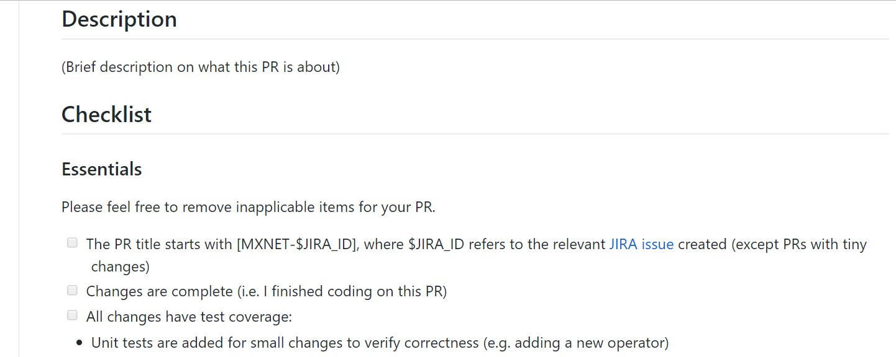
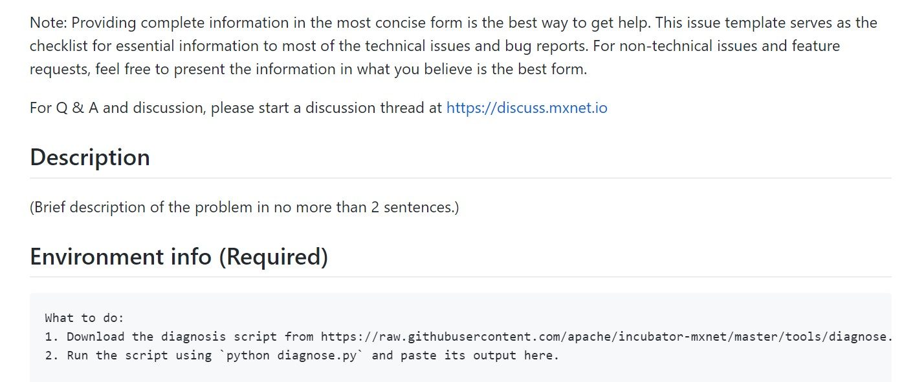

# Week 6
# 多作者 Commit 及 Commit 注意事項
* Multi author commit

* Commit 大多會限制在50個character內，並且如果超過50個character的話，第72個character必須換行，這樣在頁面中顯示時才可以有乾淨的整齊的介面
* 做法: 標記50以及72個character的時候
```
$ vim ~/.vimrc 開啟vim
set colorcolumn=50 標記第50個character
set colorcolumn=72 標記第72個character
set tw=72 換行
```
# PR 跟 ISSSUE 的 TEMPLATE
* 做法: 
  1. 移動到專案的root頁面
  2. 接下來有四種選擇
  3. 第一種是想要新增template在root，那就在root中新增PULL_REQUEST_TEMPLATE.md或ISSUE_TEMPLATE.md
  4. 第二種是想要統一整理起來並且想要讓人簡單看到(針對windows使用者)，那麼就創建一個docs目錄並新增PULL_REQUEST_TEMPLATE.md或ISSUE_TEMPLATE.md在docs下面
  5. 第三種是想要統一整理然後不想讓人看到，所以需要整理在一個隱藏目錄，創建一個.github目錄並新增PULL_REQUEST_TEMPLATE.md或ISSUE_TEMPLATE.md在.github下面
  6. 第四種是想要一次創建好幾個template給不同種PR or ISSUE使用，那麼就需要分別在docs或.github目錄下再新增一個PULL_REQUEST_TEMPLATE或ISSUE_TEMPLATE的目錄，然後分別新增PULL_REQUEST_TEMPLATE.md或ISSUE_TEMPLATE.md在目錄下面，然後你就可以串見其他不同名字的TEMPLATE了
  7. 將TEMPLATE構想寫好之後，送個commit上去，github就會自動完成剩下的步驟了，然後發個ISSUE或PR來試試看了
* cdnjs PR template

* mxnet PR template

* mxnet issue template

# Source Tree
* 對於一般喜愛方便或喜愛圖形介面的開發者或git 使用者，source tree所帶來的效益真的很強大!!!
* 不過，當然的，如果是Geeks或hacker通常還是會喜歡暗暗的bash shell啦~
